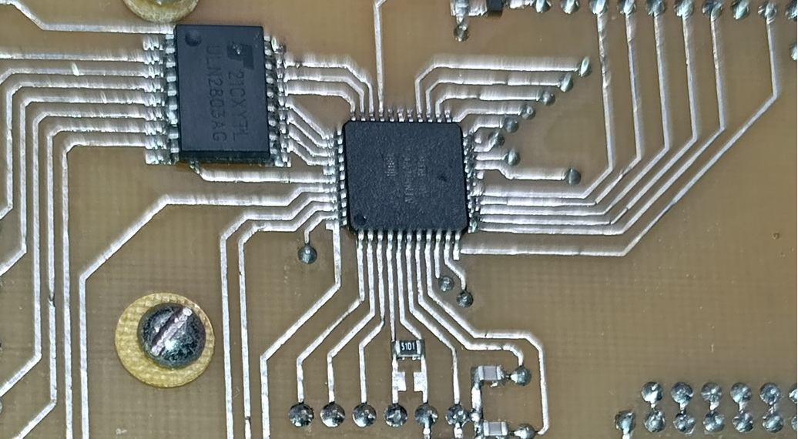

# Water leakage protection system

  

## System description

This project implements a water leakage protection controller based on AVR microcontroller.
Protection is achieved by shutting off the water supply (using 12V Gidrolock valves).
Leakage control is implemented using simple water-contact sensors. The system provides up to 7 control points.
After any of the sensors comes into contact with water, the water supply is shut off within 12-15 seconds, 
the controller provides an indication of the triggered channel (LED and sound), 
as well as signals (solid state relay and RS232 interface) to the upper-level control system (e.g. GSM controller, if required).

The alarm is reset from the main menu of the HMI panel.

The system also allows for manual valves control (from the HMI menu or remote signal).
Implemented an automatic valves rotation (by 180 degrees) once per 2 weeks against valves souring.
For power saving, the valves are powered with 12V only within 1 minute from the command moment. The rest of the time, the valves are not powered.

## HMI description

System Main Menu contains
At the first entrance (button press) the system displays the time rest before the automatic valves rotation.
After next "Enter" pressing system displays Main Menu. It has points:

* System reset command
* Manual valves open/close command
* Sensor disabling mode command
* Sound disabling mode command
* System Info menu enter command
* Exit (display disabling) command

System Info (diagnostic information) menu contains points:

* Last valves movement time
* Saved count of alarms
* Saved count of manual commands (from HMI and remote)
* Saved count of autorotations
* Saved count of system resets
* Reset all saved counters data command
* Back to the Main Menu command

## Additional functions

The counter values ​​and automatic rotation time (in days) are saved to EEPROM, so they will not be lost after a power shutdown.
In case of LCD display failure, the System Reset command can be sent by pressing buttons "Up" and "Down" at the same time for 3 seconds.

## Hardware Requirements

*   **Microcontroller:** ATMega32
*   **Valves:** Rotary ball valves Gidrolock 12V Ultimate (number of valves is depends on power of 12V supply, in this case 2)
*   **Sensors:** Simple wired contact water detectors
*   **Power:** 220VAC

## Software Architecture & Stack

*   **Language:** C
*   **Framework/IDE:** AVR Studio / Microchip Studio or `avr-gcc` toolchain
*   **Configurations:** Pinout definitions in header files: Main.h and LCD.h

### Wiring Diagram

See Schematic.pdf
Also there is information about periphery, pinouts, fuse bits and etc. in Main.c file.
